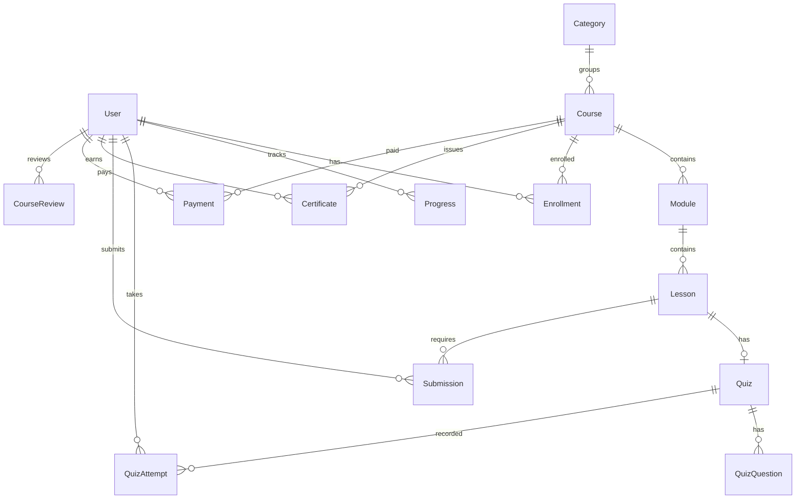

# PRD: SigmaLab

**Status**: dikembangkan — fondasi (auth, katalog, enrollment, progres, kuis, pembayaran) sudah berjalan; fitur inti *project-based learning* sedang disusun.
**Versi dokumen**: 0.1
**Terkait**: `STATUS.md`, `CHANGELOG.md`, `docs/adr/`

> Dokumen ini menjawab **apa & kenapa**. Progres ada di `STATUS.md`, riwayat rilis di `CHANGELOG.md`, keputusan teknis di `docs/adr/`.

## 1. Ringkasan Produk

SigmaLab adalah portal belajar **berbasis project** untuk publik/komunitas (B2C). Berbeda dari platform kursus video pasif, peserta tidak hanya menonton materi tetapi **menyelesaikan project nyata** yang direview oleh mentor/reviewer, lalu mendapat feedback dan sertifikat kelulusan.

Masalah yang diselesaikan: banyak kursus online berhenti di "menonton video" tanpa bukti keterampilan. SigmaLab memaksa output nyata (repo/file project + rubrik penilaian), sehingga peserta punya portofolio dan platform punya bukti hasil belajar. Model bisnis: kursus gratis sebagai akuisisi, kursus premium via pembayaran Mayar.

## 2. Prinsip Desain Utama

- **Belajar = mengerjakan.** Setiap kelas wajib punya minimal satu project submission dengan rubrik yang jelas.
- **Cepat dipahami, nol friksi** di sisi peserta: daftar → pilih kelas → kerjakan → submit → review.
- **Umpan balik manusia** (reviewer) sebagai nilai jual utama, bukan sekadar auto-grading.
- **Fondasi aman sejak awal**: data pribadi (UU PDP) dan pembayaran (scope PCI minimal via Mayar hosted).
- **Progres transparan**: peserta selalu tahu posisi, status submission, dan langkah berikutnya.
- **Redesain UI adalah track terpisah** (lihat §10).

## 3. Peran Pengguna (Roles)

| Role | Deskripsi | Akses |
|---|---|---|
| GuEST/anonim | Belum login | Lihat landing, katalog, detail kursus publik |
| LEARNER | Peserta terdaftar | Ikuti kelas, submit tugas, kuis, lihat progres & sertifikat |
| REVIEWER | Mentor/penilai | Review & beri feedback submission |
| ADMIN | Pengelola | Kelola course/module/lesson/quiz, user, enrollment, pembayaran |

## 4. Fase / Modul Pengembangan

```
FASE 1 → Fondasi & hardening (selesai sebagian)   → auth, katalog, enrollment, progres, kuis, pembayaran
FASE 2 → Inti project-based learning              → project brief + rubrik, submission, review/feedback, resubmit
FASE 3 → Kelulusan & kredibilitas                  → sertifikat + verifikasi publik, review/rating kursus, showcase project
FASE 4 → Operasional & skala                       → admin CMS, notifikasi email, dashboard, observability, backup
FASE 5 → Monetisasi lanjutan & pertumbuhan         → produksi pembayaran, paket/langganan, analitik
BACKLOG → gamifikasi, diskusi komunitas, mobile app, dsb.
```

### 4.1 Autentikasi & Akun
- Register/login kredensial (NextAuth v5, JWT), role-based.
- **Acceptance criteria**: user baru bisa daftar, login, logout; route terproteksi menolak anonim; role tersimpan di sesi.
- **Non-goals fase ini**: OAuth/SSO, 2FA.

### 4.2 Katalog & Detail Kursus
- Daftar kursus (gratis/premium), filter kategori/level, halaman detail.
- **Acceptance criteria**: kursus `isPublished` tampil; kursus non-publish tidak bocor ke publik.

### 4.3 Enrollment & Progres
- Enrollment gratis langsung aktif; progres per lesson (NOT_STARTED/IN_PROGRESS/COMPLETED).
- **Acceptance criteria**: enrollment unik per (user, course); progres tersimpan idempoten.

### 4.4 Kuis
- Kuis per lesson dengan passing score, menyimpan attempt & skor.
- **Acceptance criteria**: jawaban dinilai server-side; tidak ada kebocoran kunci jawaban ke client.

### 4.5 Project Brief & Rubrik (FASE 2)
- Lesson bertipe `SUBMISSION` punya brief project: deskripsi, deliverables, kriteria/rubrik.
- **Acceptance criteria**: brief tampil sebelum submit; rubrik terlihat peserta & reviewer.

### 4.6 Submission & Review (FASE 2)
- Peserta submit `repoUrl` + catatan (file upload menyusul — lihat ADR-0004).
- Reviewer memberi status APPROVED/REJECTED + feedback; peserta dapat resubmit.
- **Acceptance criteria**: hanya pemilik submission & reviewer/admin yang bisa akses; riwayat status tercatat.

### 4.7 Sertifikat & Verifikasi Publik (FASE 3)
- Sertifikat terbit saat seluruh syarat kelas selesai; punya `certCode` untuk verifikasi publik.
- **Acceptance criteria**: halaman verifikasi mengembalikan valid/invalid tanpa membocorkan data pribadi.

### 4.8 Pembayaran Premium (FASE 1 lanjutan)
- Checkout → invoice Mayar → webhook → enrollment aktif.
- **Acceptance criteria**: webhook terverifikasi, idempoten, status pembayaran konsisten.

### 4.9 Admin CMS (FASE 4)
- CRUD course/module/lesson/quiz, kelola reviewer & enrollment.
- **Acceptance criteria**: hanya ADMIN; perubahan tidak merusak data progres peserta.

## 5. Model Data (ERD)

Entitas utama (detail di `schema.prisma`):



Constraint penting:
- `Enrollment @@unique([userId, courseId])`, `Progress @@unique([userId, lessonId])`.
- `Certificate @@unique([userId, courseId])`, `certCode @unique`.
- `Module @@unique([courseId, order])`, `Lesson @@unique([moduleId, order])`.
- `Payment.mayarTransactionId` & `Payment.mayarInvoiceId` unik; `merchantRefId` untuk mencocokkan webhook.
- Cascade delete pada child (module/lesson/progress/submission).

## 6. Non-Functional Requirements

- **Performa**: halaman katalog/detail < 2s pada koneksi wajar; query terindeks.
- **Keamanan**: validasi input server-side (zod), RBAC, verifikasi signature webhook, rate limit endpoint sensitif, tanpa rahasia di repo.
- **Reliabilitas**: migrasi DB terkontrol; idempotensi pada webhook & progres.
- **Ketersediaan**: healthcheck `/api/health`; deploy mudah di-rollback (tag image).
- **Aksesibilitas**: target WCAG 2.1 AA dasar (kontras, fokus, alt, navigasi keyboard) — bagian dari track UI.
- **Observability**: logging terstruktur untuk error route & webhook; audit trail pembayaran (`rawWebhook`).

## 7. KPI & Metrik Keberhasilan

| Area | Metrik | Target |
|---|---|---|
| Aktivasi | Registrasi → mulai 1 lesson | ≥ 60% |
| Keterlibatan | Peserta yang submit ≥ 1 project | ≥ 30% |
| Kualitas | Median waktu review submission | ≤ 3 hari |
| Kelulusan | Peserta lulus + sertifikat | ≥ 20% dari enrolled |
| Bisnis | Konversi kursus premium | ≥ 2% dari pengunjung detail |
| Teknis | Error rate route API | < 1% |

## 8. Kepatuhan & Keamanan

- **UU PDP No. 27/2022**: dasar pemrosesan (consent saat registrasi), data minimization, hak akses/hapus, retensi, dan penanganan insiden. Data pribadi yang disimpan: nama, email, progres, submission.
- **PCI-DSS (scope minimal)**: tidak menyimpan data kartu; pembayaran dialihkan ke Mayar hosted checkout. Webhook wajib diverifikasi.
- **OWASP ASVS/Top 10**: validasi input, RBAC, manajemen sesi, secret management.
- **Status implementasi**: 🔴 belum — verifikasi webhook, validasi input, RBAC, dan kebijakan privasi ditrack sebagai pekerjaan Fase 1–2 (lihat `STATUS.md`).

## 9. Risiko & Mitigasi

| # | Risiko | Dampak | Mitigasi |
|---|---|---|---|
| 1 | Webhook palsu → enrollment gratis | Tinggi | Verifikasi signature + idempotensi (`docs/adr/0002`) |
| 2 | Kebocoran data pribadi | Tinggi | RBAC, enkripsi in-transit, audit, secret di env |
| 3 | Reviewer bottleneck | Sedang | SLA review, dashboard antrian, rubrik jelas |
| 4 | Outbound ke Mayar gagal (mis. timeout) | Sedang | Timeout + error handling, alert, retry (sudah ada dasar di route) |
| 5 | Scope melebar (redesain UI) | Sedang | UI redesign sebagai track terpisah, di-hold |
| 6 | Kehilangan data DB | Tinggi | Backup terjadwal (`pg_dump`), uji restore |

## 10. Out of Scope

- **Redesain UI/UX visual** — di-hold, punya strategi terpisah dari pemilik produk.
- OAuth/SSO, 2FA, mobile app.
- Unggah file submission ke object storage (ditunda; fase awal pakai link repo — ADR-0004).
- Langganan/paket berulang & multi-tenant instansi.
- Diskusi komunitas, gamifikasi, forum.

## 11. Ringkasan Keputusan

| # | Pertanyaan | Keputusan |
|---|---|---|
| 1 | Pengguna utama | Publik/komunitas (B2C) |
| 2 | Tim | 2–5 orang → alur PR + review |
| 3 | Stack | Next.js 16 App Router + TS + Prisma + PostgreSQL + NextAuth v5 (ADR-0001) |
| 4 | Pembayaran | Mayar hosted, sandbox dulu + hardening webhook (ADR-0002) |
| 5 | Testing | Vitest + Playwright (ADR-0003) |
| 6 | Storage submission | Link repo fase awal (ADR-0004) |
| 7 | Deploy | EasyPanel via Docker image (ADR-0005) |
| 8 | Model belajar | Submission + review + sertifikat (ADR-0006) |
| 9 | Kepatuhan | UU PDP + PCI scope minimal via Mayar |
